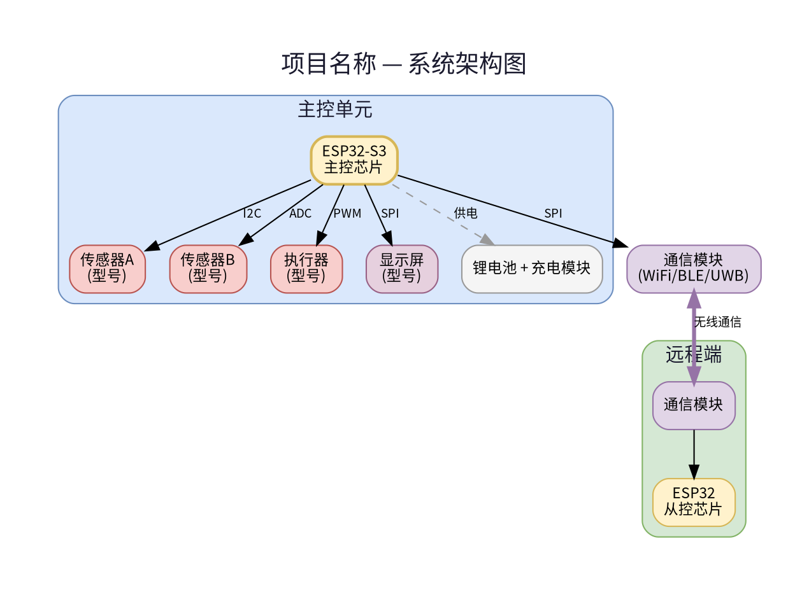
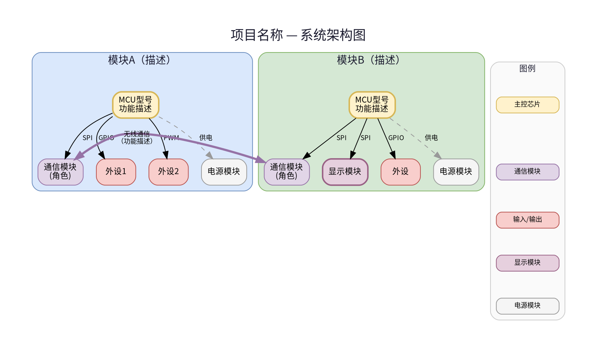
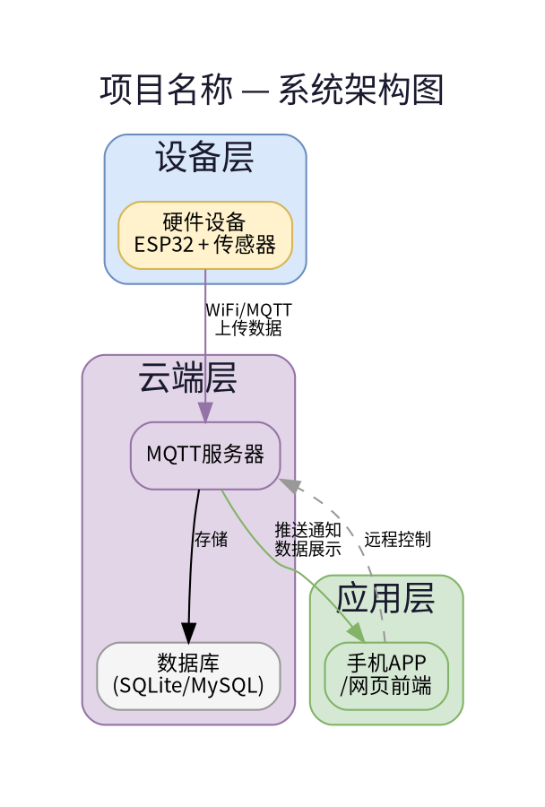
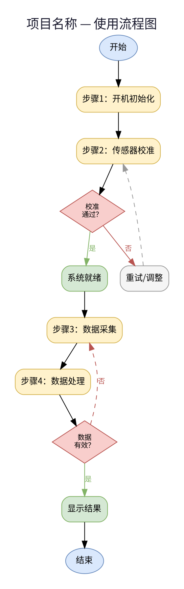
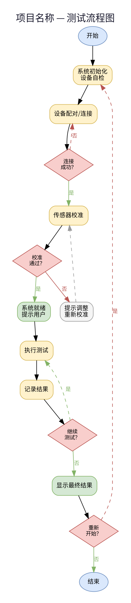
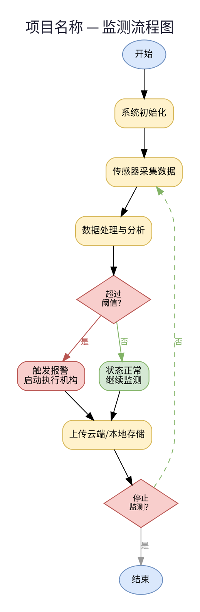

# Diagram Generation Templates

## Overview

Use Graphviz (dot) to generate two standard diagrams for every technical document:
1. **System Architecture Diagram** (`arch_diagram.png`) — shows modules, connections, communication
2. **Flow Chart** (`flow_diagram.png`) — shows usage/test workflow with decision branches

All diagrams use Chinese labels with `Noto Sans CJK SC` font. Render at 200 dpi for print quality.

---

## Common Configuration

Every `.dot` file MUST start with these settings:


### Color Scheme

Use consistent colors across both diagrams:

| Role | Fill Color | Border Color | Usage |
|------|-----------|-------------|-------|
| MCU/主控芯片 | `#fff2cc` | `#d6b656` | Main processor nodes |
| 通信模块 | `#e1d5e7` | `#9673a6` | Wireless, serial, bus modules |
| 输入/输出 | `#f8cecc` | `#b85450` | Sensors, buttons, LEDs, buzzers |
| 显示模块 | `#e6d0de` | `#996185` | Screens, displays |
| 电源模块 | `#f5f5f5` | `#999999` | Batteries, power supply |
| 成功/就绪 | `#d5e8d4` | `#82b366` | Success states, ready nodes |
| 决策判断 | `#f8cecc` | `#b85450` | Diamond decision nodes |
| 开始/结束 | `#dae8fc` | `#6c8ebf` | Ellipse start/end nodes |
| 处理步骤 | `#fff2cc` | `#d6b656` | Process/action boxes |

### Graphviz Color Note

Graphviz does NOT support shorthand hex colors like `#333` or `#ccc`. Always use full 6-digit hex: `#333333`, `#cccccc`, `#999999`.

---

## Architecture Diagram Templates

### Hardware Project (e.g., sensor device, robot)



### Dual-Module Hardware Project (e.g., controller + display unit)



### Software / IoT Project (e.g., app + cloud + device)



---

## Flow Chart Templates

### Standard Device Usage Flow



### Testing Flow with Multiple Rounds



### Monitoring/Alert Flow (e.g., fire detection, environmental monitoring)



---

## Grade Level Adaptations

### Elementary School
- **Architecture**: Simple, 3-5 nodes maximum, large text, no subgraph clusters
- **Flow chart**: Linear flow with 1-2 decision points maximum
- **Labels**: Use simple Chinese, avoid technical jargon
- **Skip legend**: Not needed for simple diagrams

### Middle School
- **Architecture**: 6-10 nodes, 1-2 subgraph clusters, show communication protocols
- **Flow chart**: 5-8 steps with 2-3 decision branches
- **Labels**: Include component models, brief function descriptions
- **Include legend**: For diagrams with 3+ color categories

### High School
- **Architecture**: 10+ nodes, multiple subgraph clusters, detailed protocol labels
- **Flow chart**: Complete workflow with error handling, retry loops, multiple branches
- **Labels**: Full technical details including protocols, data formats, algorithms
- **Include legend**: Always include legend with all categories used

---

## Rendering Commands

```bash
# Generate PNG at 200 dpi (suitable for both screen and print)
dot -Tpng -Gdpi=200 arch.dot -o arch_diagram.png
dot -Tpng -Gdpi=200 flow.dot -o flow_diagram.png

# Optional: Generate SVG for scalable output
dot -Tsvg arch.dot -o arch_diagram.svg
dot -Tsvg flow.dot -o flow_diagram.svg
```

### Troubleshooting

**Chinese characters show as boxes:**
- Ensure `fontname="Noto Sans CJK SC"` is set on graph, node, AND edge
- Verify font exists: `fc-list :lang=zh | grep -i noto`

**Colors show warnings:**
- Use full 6-digit hex codes: `#333333` not `#333`
- Named colors like `red`, `blue`, `green` also work

**Diagram too wide/tall:**
- Add `ranksep=0.5` or `nodesep=0.3` to graph attributes
- Use `constraint=false` on cross-cluster edges to reduce layout distortion
- Split into two diagrams if necessary

**Text overflow in nodes:**
- Use `\n` for line breaks in labels
- Limit labels to 3 lines, ~15 Chinese characters per line
